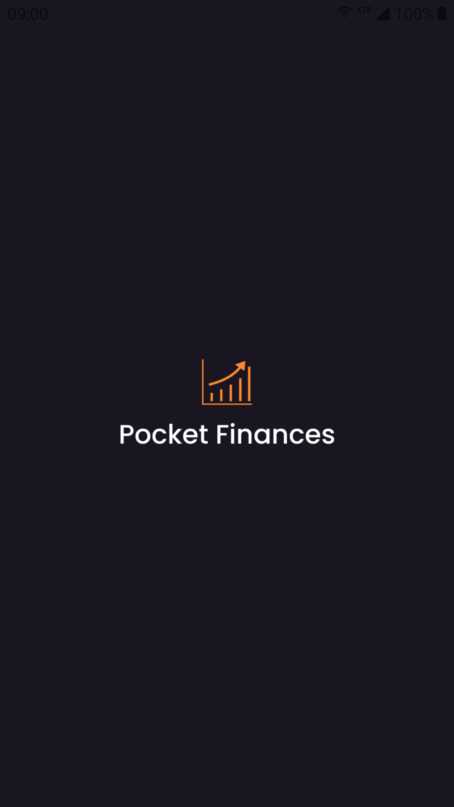

## 💻 About the project

Pocket Finances empowers you to have control of your expenses and income on the go. In addition, you will have reports of your monthly expenses per category.

Features:
- Recording of new expenses on the go.
- Recording of income on the go.
- Reports of monthly expenses per category.

** It is necessary to login with a Google account which allows the app to access your name, email and photo.

** All data entered in the application is saved on the local device, in order to keep data privacy.

#### Available in Google Play Store at: [https://play.google.com/store/apps/details?id=com.vagnercpp.pocketfinances](https://play.google.com/store/apps/details?id=com.vagnercpp.pocketfinances)

## 🛠 Technologies and concepts
- [React Native][rn]
- [Styled-Components][styled-components]
- [ReactJS][reactjs]
- [Context API][context]
- [React Hooks][hooks]
- [TypeScript][typescript]
- [Google Play][googleplay]
- [Vercel][vercel]
- [Expo][expo]
- [Node.js][nodejs]

## 💡 The application

  
  
  
  
  
  
  

## 📝 License

This application is protected by license, please verify all the details at: [https://pocketfinances.vercel.app](https://pocketfinances.vercel.app/)

Created by Vagner Vengue. ([LinkedIn])

[LinkedIn]: https://br.linkedin.com/in/vagner-vengue
[rn]: https://facebook.github.io/react-native/
[reactjs]: https://reactjs.org
[context]: https://reactjs.org/docs/context.html
[hooks]: https://reactjs.org/docs/hooks-intro.html
[typescript]: https://www.typescriptlang.org/
[googleplay]: https://play.google.com/store
[Vercel]: https://vercel.com/
[expo]: https://expo.io/
[nodejs]: https://nodejs.org/
[styled-components]: https://styled-components.com/
